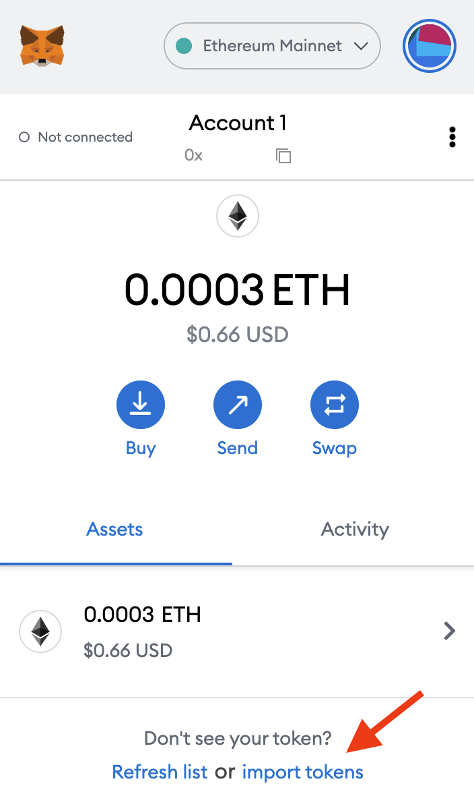

# Defi NFT Marketplace

## [Live Demo](https://raymondfam.github.io/defi-nft-marketplace-mumbai)

## How to get WETH
<ol>
<li>

[Get Goerli ETH](https://goerlifaucet.com/)

<li>

[Bridge Goerli ETH To Mumbai](https://wallet-dev.polygon.technology/bridge/)

</li>
</ol>
 

## Importing Tokens

### Token Contract Addresses:
WETH: 0xA6FA4fB5f76172d178d61B04b0ecd319C5d1C0aa

ACH: 0x2a7733842C992733a4EDDbEB4ca35F021f92965C

 

Click on 'Import tokens', located at the bottom of the 'Assets' tab on your wallet homepage

 

